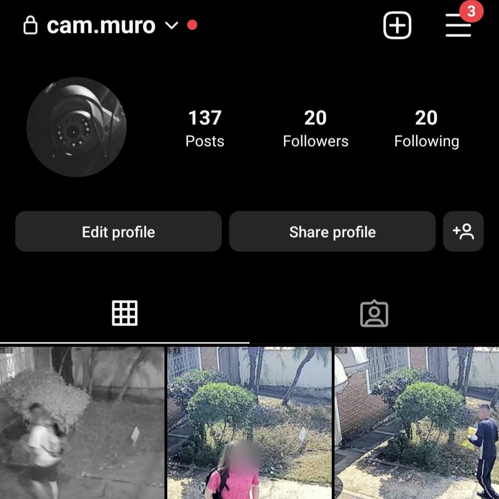
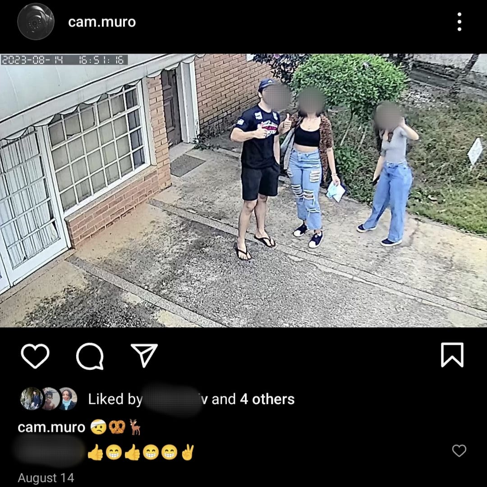

# MuroCam
## Security Camera image extraction, person recognition and instagram posting

<p float="left">
   
  
</p>

## Brief Organization
This Project is Divided in four sections:
- Image Extraction: Pools a camera over UDP and saves the images to a folder
- Person Recognition and Scoring: Uses YOLOv5 to detect people in the images and scores the images based on the number of people detected and their distance to the camera
- Instagram Posting: Generates a caption and posts the image to instagram
- Image management: Orchestrates the image location across the different sections

## How to use
- Install dependencies
```bash
pip install -r requirements.txt
```
- Create a .env file using the .env.example file as a template
- Run the script

```bash
python main.py
```


## TODO
- Improve this document
- Improve frame extraction time
- Improve detection False Positive
- Reduce Package miss over wifi
- Implement official instagram API
- Containerize application

## Future Improvemens:
- Flash LED when taking pictures
- Parallelize image extraction